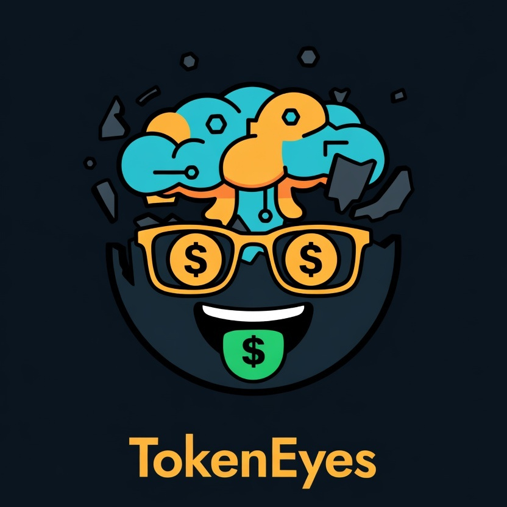
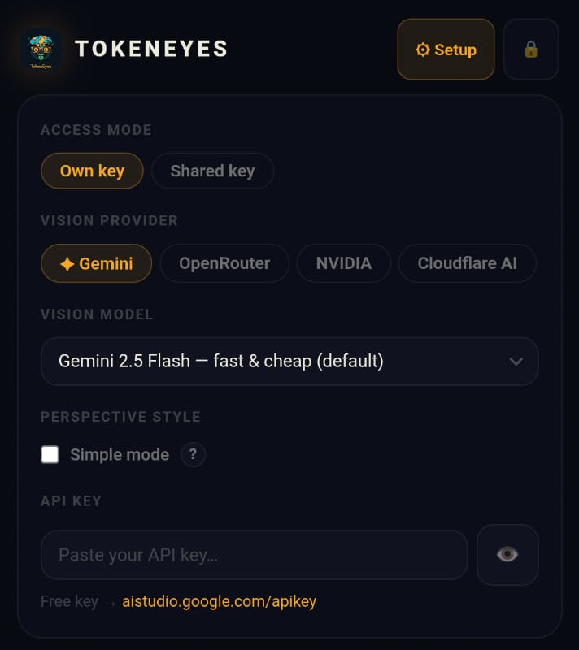
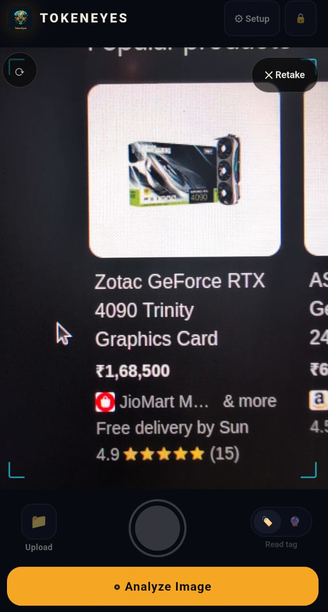
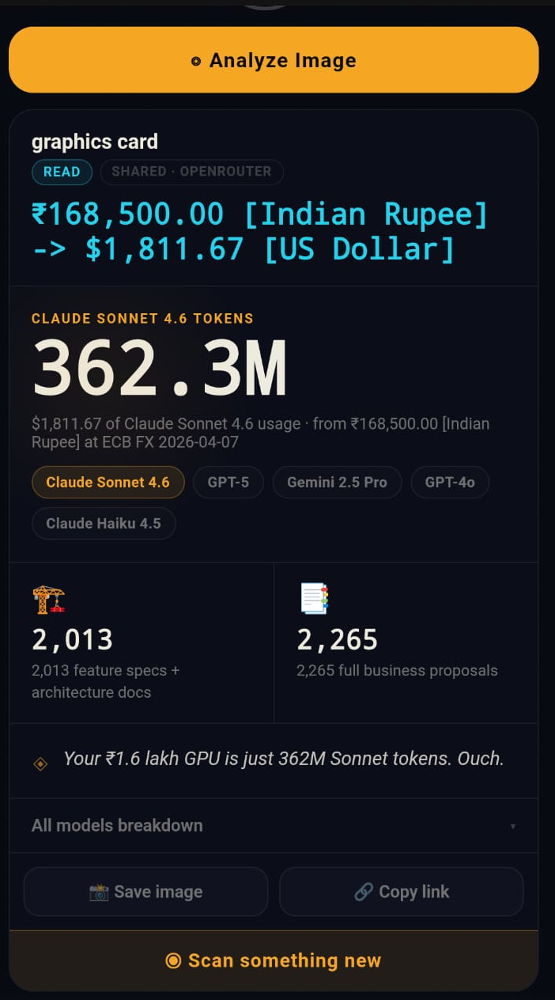

# TokenEyes

<p align="center">
  
</p>

**"Do you wanna split this ice cream?"
"No thanks, I'm watching my tokens."**

Point your camera at any price tag. Find out what it costs in AI tokens.
That $6 latte? 1.2 million Claude Sonnet tokens.

→ **[Try it live](https://token-eyes.pages.dev/)** — no signup, no backend, keys stay in your browser.

---

## What It Does

1. **Snap or upload** a photo of anything with a price (tag, menu, receipt, screen)
2. **Vision AI reads the price** — or guesses it if there's no visible tag
3. **Instant token breakdown** across 10 AI models with a culturally-aware one-liner

---

## Feature Showcase

- Camera-first mobile UI with live preview, flip camera, retake, and upload fallback.
- Two analysis modes:
  - `Read tag` for direct price extraction from images.
  - `Guess price` for estimated USD pricing when no tag is visible.
- Multi-provider own-key support in browser:
  - Gemini
  - OpenRouter
  - NVIDIA NIM
  - Cloudflare Workers AI (`ACCOUNT_ID:API_TOKEN` format)
- Shared-key mode via `/proxy` with password protection and provider fallback chain.
- Per-provider model selectors (Gemini, OpenRouter, NVIDIA, Cloudflare AI).
- Country-aware quip generation with two quip modes:
  - Normal mode: uses selected provider.
  - Simple mode: free backend quips via Workers AI.
- Token economics breakdown:
  - Hero number for primary model token equivalent.
  - Full comparison table across supported models.
  - Input/output/reasoning token split handling.
- Extra UX features:
  - Animated count-up results
  - Contextual fun facts
  - Share card image export
  - Setup/privacy drawers with key hints and safe defaults
- Zero-build static deployment on Cloudflare Pages, plus local preview with `python3 -m http.server`.

---

## Screenshots

<p align="center">
  
  
  
</p>

---

## Supported Vision Providers

Bring your own key — all have free tiers:

| Provider | Free tier | Get key |
|---|---|---|
| Google Gemini | Yes (Gemini 2.5 Flash) | [aistudio.google.com/apikey](https://aistudio.google.com/apikey) |
| OpenRouter | Yes (Qwen VL, Gemma 3, Llama Vision, more) | [openrouter.ai/keys](https://openrouter.ai/keys) |
| NVIDIA NIM | Yes (API trial/free endpoints) | [build.nvidia.com](https://build.nvidia.com/) |
| Cloudflare Workers AI | Yes (Llama 4, Gemma 4) | [dash.cloudflare.com](https://dash.cloudflare.com) |

---

## Pricing Models

Token counts are **estimates** based on an assumed split of 30% input / 20% reasoning / 50% output (40/60 for models without reasoning tokens). Real-world usage varies: chat workloads tend to be input-heavy due to long system prompts and conversation history; agentic and code workflows skew toward output and reasoning. The split is a general-purpose middle ground, not a measurement.

| Model | Input $/1M | Output $/1M |
|---|---|---|
| Claude Sonnet 4.6 | $3.00 | $15.00 |
| Claude Opus 4.6 | $5.00 | $25.00 |
| Claude Haiku 4.5 | $1.00 | $5.00 |
| Gemini 2.5 Pro | $1.25 | $10.00 |
| Gemini 2.5 Flash | $0.30 | $2.50 |
| Gemini 2.5 Flash-Lite | $0.10 | $0.40 |
| GPT-5 | $1.25 | $10.00 |
| GPT-4o | $2.50 | $10.00 |
| o4-mini | $1.10 | $4.40 |
| GPT-4o Mini | $0.15 | $0.60 |

---

## Python CLI

```bash
pip install -e .

tokeneyes photo.jpg              # read price from image
tokeneyes shoe.jpg --guess       # AI guesses the price (no visible tag)
tokeneyes --price 5.99           # skip vision, just convert
tokeneyes --list-models          # show all supported models
tokeneyes-web                    # start local web UI (port 8000)
```

Requires `GEMINI_API_KEY` or `OPENROUTER_API_KEY` in your environment or a `.env` file.

---

## Self-Host the Web App

The web app is a single static HTML file — no build step, no server.

```bash
git clone https://github.com/disc0nnctd/TokenEyes
cd TokenEyes/cloudflare
python3 -m http.server 3000
```

Deploy to Cloudflare Pages by dragging the `cloudflare/` folder to [pages.cloudflare.com](https://pages.cloudflare.com).
See [cloudflare/DEPLOY.md](./cloudflare/DEPLOY.md) for full instructions including optional free quip generation via Workers AI.

---

## Ideas / Roadmap

- **Receipt mode** — scan a full receipt, see every line item as tokens
- **Browser extension** — hover any price on any webpage for an instant token tooltip
- **Reverse mode** — "I have $20 in API credits, what does that buy me in the real world?"
- **Per-user agent consumption tracking** — log your daily Claude Code / API usage and see it expressed as real-world costs ("this week's agent sessions = 3 lattes")
- **AR glasses** — real-time price-tag overlay when open camera SDKs become available (Meta Ray-Ban, etc.)

---

## Privacy

- Keys are **memory-only** in your browser — gone when you close the tab
- All API calls go **directly from your browser** to the provider — no TokenEyes server in the path
- Nothing is logged or stored by us

---

## License

MIT
