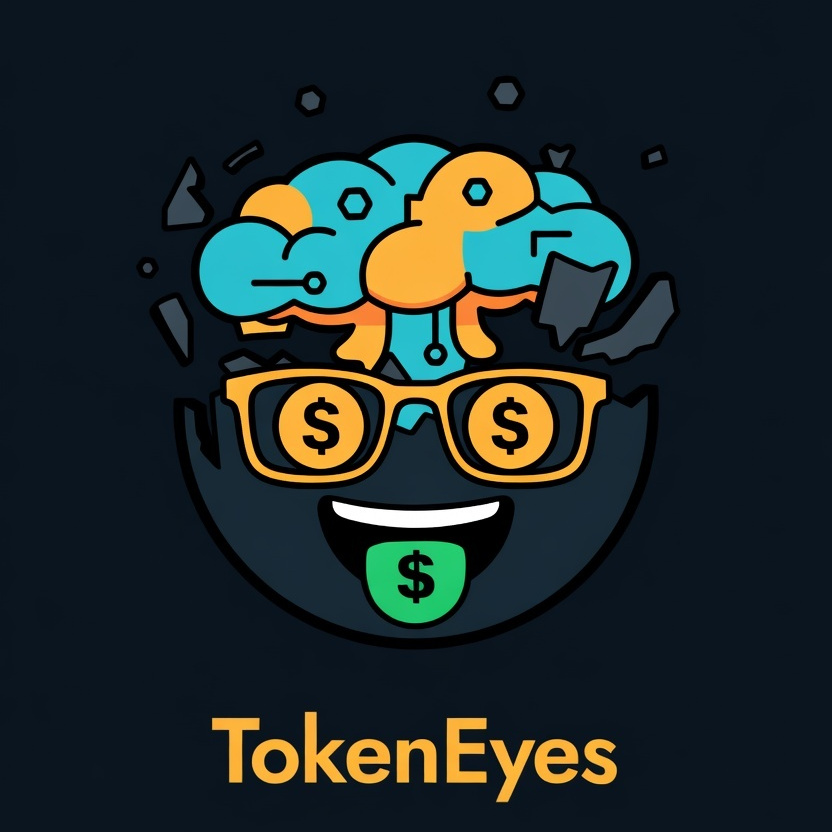
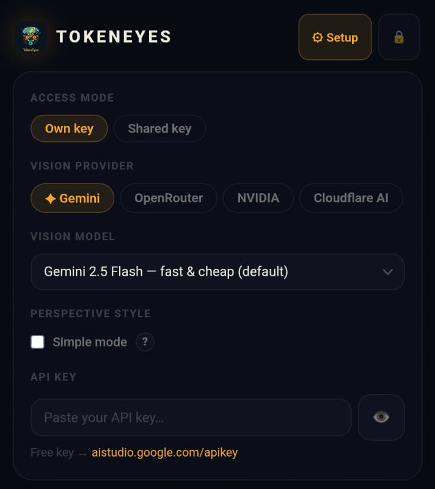
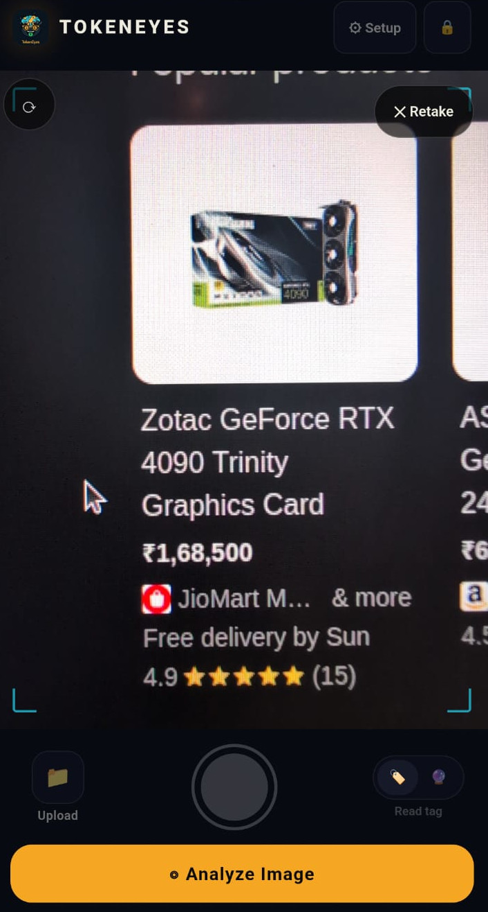
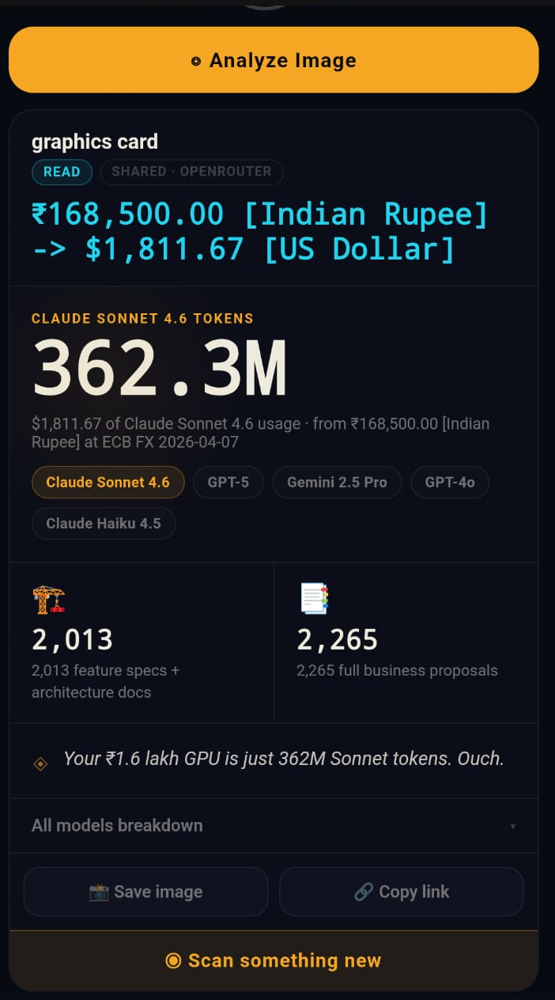

# TokenEyes

<p align="center">
  
</p>

**"Do you wanna split this ice cream?"
"No thanks, I'm watching my tokens."**

Point your camera at any price tag. Find out what it costs in AI tokens.
That $6 latte? 1.2 million Claude Sonnet tokens if you're chatting — but
**17 million** if you're a coding agent, because agents re-read a prompt-cached
context that bills at a tenth of the price. Same money, 14x more tokens. The gag
is a Trojan horse for the one pricing fact most token calculators get wrong.

→ **[Try it live](https://token-eyes.pages.dev/)** — no signup, no backend, keys stay in your browser.

---

## What It Does

1. **Snap or upload** a photo of anything with a price (tag, menu, receipt, screen)
2. **Vision AI reads the price** — or guesses it if there's no visible tag
3. **Instant token breakdown** across 17 AI models with a culturally-aware one-liner

Or run it backwards. **"I spent $47 on Claude this month"** → *9.4 flat whites.*
Reverse mode needs no API key and makes no network call — it's pure browser math, so
it works the second the page loads.

---

## Feature Showcase

- Camera-first mobile UI with live preview, flip camera, retake, and upload fallback.
- Two analysis modes:
  - `Read tag` for direct price extraction from images.
  - `Guess price` for estimated USD pricing when no tag is visible.
- Multi-provider own-key support in browser:
  - Gemini
  - OpenRouter
  - NVIDIA NIM
  - Cloudflare Workers AI (`ACCOUNT_ID:API_TOKEN` format)
- Shared-key mode via `/proxy` with password protection and provider fallback chain.
- Per-provider model selectors (Gemini, OpenRouter, NVIDIA, Cloudflare AI).
- Provider-generated quips with a skip toggle:
  - Default: selected provider returns price + item-specific quips in one response.
  - `Skip quips`: clean token breakdown only.
- Reverse mode: turn an AI bill into real-world objects, client-side, with no API key.
- Token economics breakdown:
  - Hero number for primary model token equivalent.
  - Full comparison table across supported models.
  - Input / cached / thinking / output token split handling.
  - Four workload profiles (coding agent, chat, RAG, one-shot), or set your own split.
  - Prompt-cache aware — cached input bills at ~10%, which is most of the story for agents.
- Live FX: `/fx` refreshes ECB reference rates daily via KV, with a pinned table as fallback.
- Extra UX features:
  - Animated count-up results
  - Contextual fun facts
  - Share card image export
  - Setup/privacy drawers with key hints and safe defaults
- Zero-build static deployment on Cloudflare Pages, plus local preview with `python3 -m http.server`.

---

## Screenshots

<p align="center">
  
  
  
</p>

---

## Supported Vision Providers

Bring your own key — all have free tiers:

| Provider | Free tier | Get key |
|---|---|---|
| Google Gemini | Yes (Gemini 2.5 Flash) | [aistudio.google.com/apikey](https://aistudio.google.com/apikey) |
| OpenRouter | Yes (Qwen VL, Gemma 3, Llama Vision, more) | [openrouter.ai/keys](https://openrouter.ai/keys) |
| NVIDIA NIM | Yes (API trial/free endpoints) | [build.nvidia.com](https://build.nvidia.com/) |
| Cloudflare Workers AI | Yes (Llama 4, Gemma 4) | [dash.cloudflare.com](https://dash.cloudflare.com) |

---

## Pricing Models

Token counts are **estimates**. You pick a workload profile and the math follows from it:

| Profile | Input | Cached | Thinking | Output |
|---|---|---|---|---|
| Coding agent | 10% | 55% | 15% | 20% |
| Chat | 25% | — | 15% | 60% |
| RAG | 30% | 45% | 5% | 20% |
| One-shot | 40% | — | — | 60% |

Two things most token calculators get wrong, and this one doesn't:

- **Cached input is ~10% of the normal rate.** A coding agent re-reads a big prompt-cached
  prefix every single turn, so the same money goes roughly **14x** further than it does in
  chat. That $6 latte is 1.2M Sonnet 5 tokens of conversation — or 17M tokens of Claude Code.
- **Thinking tokens bill at the output rate, not the input rate.** Pricing them as input
  understates reasoning-heavy work by about 5x on Claude models.

Models without a cached or thinking tier get those shares folded into the nearest bucket,
so every profile always accounts for 100% of the budget. Percentages are of *tokens*, not
of spend. It's still a made-up split — just an honest one.

Prices below are USD per 1M tokens, verified 2026-07-22. Claude Sonnet 5 is at its
introductory tier ($3.00 / $15.00 from 2026-09-01).

| Model | Input $/1M | Output $/1M |
|---|---|---|
| Claude Fable 5 | $10.00 | $50.00 |
| Claude Opus 4.8 | $5.00 | $25.00 |
| Claude Sonnet 5 | $2.00 | $10.00 |
| Claude Sonnet 4.6 | $3.00 | $15.00 |
| Claude Haiku 4.5 | $1.00 | $5.00 |
| GPT-5.6 Sol | $5.00 | $30.00 |
| GPT-5.6 Terra | $2.50 | $15.00 |
| GPT-5.6 Luna | $1.00 | $6.00 |
| GPT-5.4 Mini | $0.75 | $4.50 |
| GPT-5.4 Nano | $0.20 | $1.25 |
| Gemini 3 Pro | $2.00 | $12.00 |
| Gemini 3 Flash | $0.50 | $3.00 |
| Gemini 2.5 Flash | $0.30 | $2.50 |
| Gemini 2.5 Flash-Lite | $0.10 | $0.40 |
| Kimi K3 | $3.00 | $15.00 |
| DeepSeek V4 Pro | $0.435 | $0.87 |
| DeepSeek V4 Flash | $0.14 | $0.28 |

---

## Python CLI

```bash
pip install -e .

tokeneyes photo.jpg              # read price from image
tokeneyes shoe.jpg --guess       # AI guesses the price (no visible tag)
tokeneyes --price 5.99           # skip vision, just convert
tokeneyes --list-models          # show all supported models
tokeneyes-web                    # start local web UI (port 8000)
```

Requires `GEMINI_API_KEY` or `OPENROUTER_API_KEY` in your environment or a `.env` file.

---

## Self-Host the Web App

The web app is a single static HTML file — no build step, no server.

```bash
git clone https://github.com/disc0nnctd/TokenEyes
cd TokenEyes/cloudflare
python3 -m http.server 3000
```

Deploy to Cloudflare Pages by dragging the `cloudflare/` folder to [pages.cloudflare.com](https://pages.cloudflare.com).
See [cloudflare/DEPLOY.md](./cloudflare/DEPLOY.md) for full instructions including optional free quip generation via Workers AI.

---

## Ideas / Roadmap

- **Receipt mode** — scan a full receipt, see every line item as tokens
- **Browser extension** — hover any price on any webpage for an instant token tooltip
- **Import a real bill** — drop in a Claude Code / OpenAI usage CSV instead of typing the total
- **Per-user agent consumption tracking** — log your daily Claude Code / API usage and see it expressed as real-world costs ("this week's agent sessions = 3 lattes")
- **AR glasses** — real-time price-tag overlay when open camera SDKs become available (Meta Ray-Ban, etc.)

---

## Privacy

- Keys are **memory-only** in your browser — gone when you close the tab
- All API calls go **directly from your browser** to the provider — no TokenEyes server in the path
- Nothing is logged or stored by us

---

## License

MIT
